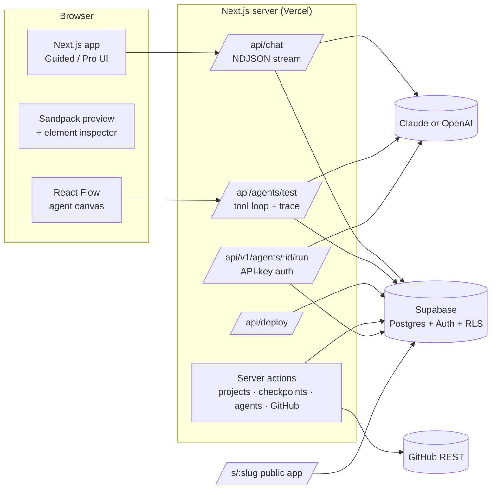

# Architect 2.0

**Describe it. Approve the plan. Ship the agent.**
A vibe-coding platform for agentic apps, where technical and non-technical builders work on the same project.

- **Live app:** `<add Vercel URL>`
- **Demo walkthrough (3 min):** `<add Loom link>`
- **Demo login:** `<demo email / password>`

---

## 1. The problem

Vibe-coding tools split the market in two:

- **Beginner tools** (Lovable, Bolt, v0, Rocket, Emergent) make the first five minutes magical, then hit a wall. Users can't tell what was built, can't debug it, and get stuck when the AI breaks something.
- **Pro tools** (Cursor, Claude Code, Codex, Replit Agent) are powerful but assume you read code. They are IDE-first, not app-first or agent-first.
- **Architect today** is agent-first and enterprise-grade. But it feels intimidating to a non-technical user, and it doesn't meet engineers in their own repos and frameworks.

## 2. The insight

> **Technical skill is a dial, not a user type.**

The same person can be non-technical about deployment and technical about prompt logic. So Architect 2.0 does not ship two products. It ships **one project model with a Guided ⇄ Pro switch**, which you can flip per project at any time. The plan, checkpoints, agent and deployments stay the same; what changes is how much of the machinery you see.

| | Guided | Pro |
|---|---|---|
| Start | Goal templates, plain-English prompt | Prompt, **GitHub import**, framework choice |
| Before building | A readable **plan card** to approve | The same plan, with data model and pipeline detail |
| While building | "Laying out the main screen…" | "Writing /components/Inbox.tsx" |
| Code | Read-only peek | Monaco editor, diffs, manual edits become checkpoints |
| Agent | Blocks called *Brain, Action, Knowledge, Rules* | *LLM, Tool, RAG, Guardrails* + generated framework code |
| Ship | One-click deploy, share link, QR code | Env vars, preview/prod, rollback, pull requests |

## 3. Product principles

1. **Plan before build.** Nothing is generated until the user approves a plan covering screens, data, agent steps and rules. In Guided mode, vague requests first get a few one-click questions, and the plan card can be edited directly. This removes blank-prompt anxiety and wasted generations.
2. **Never stuck.** Every AI change is a checkpoint. Restore is one click and never destroys history. Preview errors come with **Auto-fix**.
3. **Explain, don't hide.** Every change says *what changed and why*. Pro users also get the diff.
4. **Agents are first-class.** The app and its agent (tools, knowledge, guardrails) are designed together and tested with a step-by-step trace.
5. **Own your code.** Import from GitHub, push to a new repo, or open a PR. There's no lock-in.

## 4. Core flows

1. **Non-technical: idea → live app.**
   Sign up → onboarding (the *no code ↔ full control* dial sets the default mode) → pick "Support ticket triage" → approve the plan → watch it build → **select an element in the preview** and say "make this green" → try the agent in the test console → **Deploy** → share the QR code.
2. **Technical: repo → agent → PR.**
   Import a GitHub repo (the stack and existing AI libraries are detected) → describe the agent to add → approve the plan → review diffs in the code editor → pick LangGraph in the agent tab → test with a trace → **Open PR**.
3. **Recovery.**
   A change breaks the preview → **Auto-fix**, or restore any checkpoint from the timeline.
4. **Mode switch.**
   Flip Guided → Pro on the same project: the code, diffs, framework picker and env vars appear. Nothing is lost.

## 5. Feature map: what's real vs. simulated

All eight required features are present. I'd rather be explicit than let a demo overclaim.

| Feature | Status | Notes |
|---|---|---|
| **Authentication** (email, Google, GitHub) | ✅ Real | Supabase Auth; row-level security on every table |
| **Homepage / dashboard** | ✅ Real | Prompt box with mode switch, templates, recent projects |
| **Chat window** | ✅ Real | Claude (`claude-opus-5`) **or OpenAI** (`gpt-5.5`), streaming; tool calls for `propose_plan` / `write_files`; schema-validated before anything is saved |
| Clarifying questions (Guided) | ✅ Real | When a request is vague, the AI asks up to 3 one-click multiple-choice questions before planning (`ask_questions` tool); skippable; `/ask` in Pro |
| Editable plan card | ✅ Real | Edit screens, agent steps (drag to reorder), data, rules, integrations and assumptions inline; the build follows the edited plan |
| Screenshot / document → app | ✅ Real | Attach, paste or drop up to 3 images, PDFs or text files; images are downscaled in the browser, stored privately per user, and sent to Claude or GPT as images/documents until a build has used them |
| **App preview** | ✅ Real | Sandpack runs the generated React + Tailwind app in the browser; device sizes; open in new tab |
| **UI building** | ✅ Real | Select-to-edit in the preview, Monaco editor, diffs, manual edits |
| **Agent section** | ✅ Real | React Flow canvas, settings for each block, autosave, live test console with trace |
| — web search tool | ✅ Real on Claude | Anthropic server-side web search; simulated when the agent runs on OpenAI |
| — email / Slack / CRM / ticket / SQL / HTTP tools | 🟡 Simulated | Realistic responses, labelled "simulated" in the trace |
| — knowledge files (PDF / TXT / MD) | ✅ Real | Text extracted per page on upload (`unpdf`), split into passages and ranked per question with BM25; the answer cites file and page, and the trace shows what was retrieved |
| — PII redaction guardrail | ✅ Real | Masks emails, phone numbers and card numbers in agent replies |
| — framework code (LangGraph, CrewAI, OpenAI Agents SDK, Claude Agent SDK, Google ADK, Lyzr blueprint) | 🟡 Generated starter | Kept in sync with the canvas; not executed by the platform |
| **GitHub integration** | ✅ Real | Repo listing, stack detection, new-repo push, **real branch + commit + pull request** |
| **Deployment** | ✅ Real link | The checkpoint is frozen to a public `/s/<slug>` URL; preview/prod; rollback. Build logs are staged for UX. |
| Checkpoints & restore | ✅ Real | Non-destructive restore |
| Credits / usage | ✅ Real | 100 credits/day, refilled and spent only through database functions (clients can't edit balances); token and latency charts from real runs |
| Project thumbnails | ✅ Real | The sandbox renders its own viewport to a JPEG after each new version; stored in a public bucket and shown on dashboard cards |
| Project management | ✅ Real | Rename, duplicate (latest checkpoint + agent), delete with typed confirmation for live apps; searchable `/projects` |
| Settings & bring-your-own keys | ✅ Real | Profile, default mode and dial, theme; Anthropic/OpenAI keys verified with the provider, stored encrypted, used instead of platform credits |
| Product metrics | ✅ Real | 15 server-side events → admin `/metrics`: activation funnel, plan approval rate, restores per project, Guided⇄Pro switches, weekly deployed apps (North Star) |
| Custom domains | 🟡 Mock | Saved and shown as "waiting for DNS" |
| **Evals** | ✅ Real | Saved test cases per agent — *contains*, *doesn't contain*, or *AI judge* (the same provider at low effort answers PASS/FAIL with a reason); Run all streams verdicts with progress, keeps pass-rate history, and runs the canvas as it is now, so a rule change can be checked immediately; **Save as test** from any console run. AI-judged checks are skipped (not guessed) in demo mode |
| **Agent API** | ✅ Real | Per-agent keys (`arc_live_…`, shown once, stored as SHA-256 hashes, revocable); `POST /api/v1/agents/:id/run` returns `{ output, trace, tokens, latency_ms }`; 60 requests/min per key counted in Postgres; runs through the same runner as the test console; no service-role key (security-definer RPCs) |
| First-run tour | ✅ Real | Guided and Pro versions; spotlight never blocks clicks and never covers its target; keyboard (←, →, Esc); steps whose target isn't on screen are skipped (e.g. on phones); once per user (`profiles.tour_completed` + local fallback); **Replay tour** in Settings |
| Team invites | ⏳ Coming soon | Labelled in the UI |
| Pricing | 🟡 Illustrative | |
| Demo mode | ✅ | Without an Anthropic key, the build flow is scripted so the demo never breaks |

## 6. Architecture



**Stack:** Next.js 16 (App Router, `proxy.ts`), TypeScript, Tailwind v4, shadcn/ui (Base UI), Framer Motion, Supabase, `@anthropic-ai/sdk` + `openai` (model-agnostic provider layer), Sandpack, Monaco, React Flow, Zustand.

**Design choices worth calling out**
- **Tool calls instead of free-text code.** The model returns a plan or complete files through typed tools with streamed input, so progress ("Writing /App.tsx") shows as it happens. Nothing is saved unless it passes a Zod schema.
- **A tight contract for generated apps:** a React + Tailwind single-page app with seeded data and a simulated agent. It renders instantly in the browser with no build servers, which is the right trade-off for a first version.
- **Byte-stable system prompt with prompt caching.** Per-turn context (mode, files, repo summary) goes in the last message, so the prefix stays cached across turns.
- **Deploy = a frozen checkpoint.** The public page reads a snapshot, so a live app never changes under a user's feet, and rollback is just changing which snapshot is current.

**Security:** row-level security on every table; clients can't write their own credit balance; GitHub tokens (cookie) and env-var values (database) are AES-256-GCM encrypted with `ARCHITECT_SECRET`; post-login redirects accept only same-origin paths; generated apps run in a cross-origin sandbox iframe.

**Tests:** `npm test` (Vitest: 58 unit tests covering redirect safety, encryption, agent compilation, PII redaction, code generation, builder schemas, repo parsing, retrieval, API keys, eval grading, tour placement) and `npm run test:e2e` (Playwright on desktop + mobile: public pages, auth gating, open-redirect protection, agent API auth, no horizontal overflow).

**Data model (Postgres, RLS on every table):** `profiles`, `projects`, `messages`, `checkpoints (files jsonb)`, `agents (graph jsonb)`, `agent_runs (trace jsonb)`, `deployments (files snapshot, slug, is_current)`, `env_vars`, `events`, `user_secrets`, `admins`, `knowledge_docs`, `api_keys`, `eval_cases`, `eval_runs`. See `supabase/migrations/`.

## 7. What I'd measure

- **North star:** weekly *deployed* agentic apps.
- **Activation:** % of signups reaching a working preview in under 5 minutes.
- **Plan approval rate:** a proxy for whether the AI understood the intent.
- **Restores per project:** a proxy for AI error rate (lower is better).
- **Guided → Pro switches:** users growing into more control.
- **Import share among technical users**, and 7-day retention.

## 8. What I left out on purpose, and what's next

- **Full-stack runtimes** (a real backend per app via E2B or WebContainers). The sandbox contract was chosen for instant, reliable previews in a first version.
- **Multi-agent orchestration** (a manager block over sub-agents), and evals on real traffic (sampling production API runs into test cases).
- **Real integrations** behind the simulated tools (OAuth connectors for Slack, Gmail, HubSpot).
- **Team workspaces**, roles, comments on the preview, SSO.

## 9. Run it locally

```bash
cp .env.example .env.local      # Supabase URL + anon key, ARCHITECT_SECRET, and optionally an Anthropic or OpenAI key
npm install
# apply the SQL in supabase/migrations/ (SQL editor or `supabase db push`)
npm run dev
```

Supabase settings: Site URL = your app URL; redirect URLs = `http://localhost:3000/**` and your production URL. For GitHub sign-in, create a GitHub OAuth App with callback `https://<project-ref>.supabase.co/auth/v1/callback`.

---

Built for the Lyzr Architect hiring challenge. See also [`docs/product-spec.md`](docs/product-spec.md) and [`docs/competitive-teardown.md`](docs/competitive-teardown.md).
