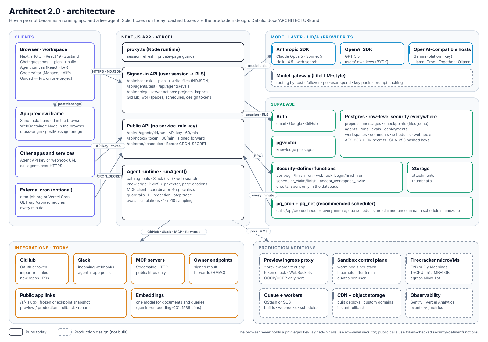

# Architect 2.0

**Describe it. Approve the plan. Ship the agent.**
A vibe-coding platform for agentic apps, where technical and non-technical builders work on the same project.

- **Live app:** https://lyzr-architect-2-0-orcin.vercel.app
- **Demo walkthrough (5 min):** `<add Loom link>`
- **Try it:** sign up with any email and password. There's no email confirmation, and every account gets 100 credits a day.

---

## 1. The problem

Vibe-coding tools split the market in two:

- **Beginner tools** (Lovable, Bolt, v0, Rocket, Emergent) make the first five minutes magical, then hit a wall. Users can't tell what was built, can't debug it, and get stuck when the AI breaks something.
- **Pro tools** (Cursor, Claude Code, Codex, Replit Agent) are powerful but assume you read code. They are IDE-first, not app-first or agent-first.
- **Architect today** is agent-first and enterprise-grade. But it feels intimidating to a non-technical user, and it doesn't meet engineers in their own repos and frameworks.

## 2. The insight

> **Technical skill is a dial, not a user type.**

The same person can be non-technical about deployment and technical about prompt logic. So Architect 2.0 does not ship two products. It ships **one project model with a Guided ⇄ Pro switch**, which you can flip per project at any time. The plan, checkpoints, agent and deployments stay the same; what changes is how much of the machinery you see.

| | Guided | Pro |
|---|---|---|
| Start | Goal templates, plain-English prompt | Prompt, **GitHub import**, framework choice |
| Before building | A readable **plan card** to approve | The same plan, with data model and pipeline detail |
| While building | "Laying out the main screen…" | "Writing /components/Inbox.tsx" |
| Code | Read-only peek | Monaco editor, diffs, manual edits become checkpoints |
| Agent | Blocks called *Brain, Action, Knowledge, Rules* | *LLM, Tool, RAG, Guardrails* + generated framework code |
| Ship | One-click deploy, share link, QR code | Env vars, preview/prod, rollback, pull requests |

## 3. Product principles

1. **Plan before build.** Nothing is generated until the user approves a plan covering screens, data, agent steps and rules. In Guided mode, vague requests first get a few one-click questions, and the plan card can be edited directly. This removes blank-prompt anxiety and wasted generations.
2. **Never stuck.** Every AI change is a checkpoint. Restore is one click and never destroys history. Preview errors come with **Auto-fix**.
3. **Explain, don't hide.** Every change says *what changed and why*. Pro users also get the diff.
4. **Agents are first-class.** The app and its agent (tools, knowledge, guardrails) are designed together and tested with a step-by-step trace. **Autopilot** then red-teams the agent, fixes the rules it broke and proves the fix with a before → after score.
5. **Own your code.** Import from GitHub, push to a new repo, or open a PR. There's no lock-in.
6. **Meet builders where they work.** Every agent is also an **MCP server**, so it can be called from Cursor, VS Code, Claude Desktop or another agent with one pasted config.

## 4. Core flows

1. **Non-technical: idea → live app.**
   Sign up → onboarding (the *no code ↔ full control* dial sets the default mode) → pick "Support ticket triage" → approve the plan → watch it build → **select an element in the preview** and say "make this green" → try the agent in the test console → **Deploy** → share the QR code.
2. **Technical: repo → agent → PR.**
   Import a GitHub repo (the stack and existing AI libraries are detected) → describe the agent to add → approve the plan → review diffs in the code editor → pick LangGraph in the agent tab → test with a trace → **Open PR**.
3. **Recovery.**
   A change breaks the preview → **Auto-fix**, or restore any checkpoint from the timeline.
4. **Mode switch.**
   Flip Guided → Pro on the same project: the code, diffs, framework picker and env vars appear. Nothing is lost.

## 5. Feature map: what's real vs. simulated

All eight required features are present. I'd rather be explicit than let a demo overclaim. "Needs migration NNNN" means the feature works once that SQL file in `supabase/migrations/` has been run.

| Feature | Status | Notes |
|---|---|---|
| **Authentication** | ✅ Real | Email/password with password reset, Google; Supabase Auth with row-level security on every table. GitHub is used to connect repos (OAuth once configured in Supabase, or a personal access token) |
| **Homepage / dashboard** | ✅ Real | Prompt box with mode switch, templates page, recent projects, "Shared with you", command palette (⌘K) |
| **Chat window** | ✅ Real | Streaming via `@anthropic-ai/sdk` (Claude) or any OpenAI-compatible endpoint (this deployment runs on Gemini); typed tools `ask_questions` / `propose_plan` / `write_files`, validated before anything is saved; stop with ⌘. |
| Clarifying questions | ✅ Real | Up to 3 one-click questions, plus typed-in fields when the app needs a connection: a Slack webhook (saved encrypted, never shown in chat), times, text |
| Editable plan card | ✅ Real | Edit screens, agent steps (drag to reorder), data, rules, integrations and assumptions; the build follows the edited plan |
| Screenshot / document → app | ✅ Real | Up to 3 images, PDFs or text files per message, stored privately per user |
| Brand design system | ✅ Real · needs 0016 | Settings → Design system reads CSS variables or design-token JSON (Figma variable exports too); every build uses your colours, fonts and radius |
| **App preview** | ✅ Real | Sandpack in the browser (device sizes, full-page view); WebContainer runs the same app as a real Vite project; E2B is wired but needs a key |
| **UI building** | ✅ Real | Select-to-edit, Auto-fix, Monaco editor with diffs, manual edits become checkpoints, branch a new project from any checkpoint |
| Generated apps that act | ✅ Real | Apps call `postToSlack()` from the platform helper; the owner's clicks post to the real channel, everyone else's are simulated |
| **Agent section** | ✅ Real | React Flow canvas, per-block settings, autosave, test console with a step-by-step trace |
| — models | ✅ Real | Claude Opus 5 / Sonnet 5 / Haiku 4.5, GPT-5.5, Gemini, Llama (any OpenAI-compatible host); bring your own keys in Settings |
| — tools | ✅ / 🟡 | Live: web search (Claude), Slack, **MCP servers** (any Streamable-HTTP server; tokens encrypted). The other 25+ catalog tools (Notion, Jira, HubSpot…) return realistic results labelled "simulated" |
| — knowledge files | ✅ Real | PDF/TXT/MD split into passages; keyword (BM25) ranking, plus semantic search with pgvector once migration 0010 is in; answers cite file and page |
| — multi-agent | ✅ Real | A Coordinator block delegates to Specialist agents; the trace shows each hand-off (test console and evals; API, MCP, webhook and scheduled runs answer with the coordinator alone for now) |
| — guardrails | ✅ Real | Rules in the prompt, "Safe AI" presets, PII redaction on replies |
| — schedules | ✅ Real · needs 0017 + cron | Trigger "Schedule": times, weekdays and timezone; runs on time through `/api/cron/schedules` (see docs/ARCHITECTURE.md §10) |
| — framework code | 🟡 Generated starter | LangGraph, CrewAI, OpenAI Agents SDK, Claude Agent SDK, Google ADK, Lyzr blueprint; kept in sync with the canvas, export-only |
| **Evals** | ✅ Real | Saved tests (contains / doesn't contain / AI judge), pass-rate history, suggested tests sampled from real traffic (needs 0014) |
| **Autopilot** (self-improving agents) | ✅ Real | Writes 6 scenarios aimed at *this* agent's job and rules (edge cases, injection, personal data, off-topic, invented promises), runs them, reads the failures, proposes new rules or rewritten instructions, applies them and re-tests everything: e.g. 3/6 → 6/6. Scenarios can be saved as regression tests |
| **Agent API** | ✅ Real | Per-agent keys (`arc_live_…`, SHA-256 hashed, revocable), 60 requests/min, cURL/JS/Python snippets |
| **Agents as MCP servers** | ✅ Real | `POST /api/mcp/:agentId` speaks MCP (Streamable HTTP, protocol 2024-11-05 → 2025-06-18); the agent appears as one `ask_<agent>` tool. Copy-paste config for Cursor, VS Code and Claude Desktop; same keys, rate limits, credits and logs as the API |
| **Inbound webhooks** | ✅ Real | Integrations page: a secret URL per agent, pause, rotate, recent calls, optional HMAC-signed forward of the result |
| **GitHub integration** | ✅ Real | Connect, list repos, detect the stack, **import the repo's real files**, push a new repo, open pull requests that change the real files; GitAgent sets branch prefix, commit style and PR conventions |
| ZIP import / export | ✅ Real | Upload a local project as a ZIP; "Download" exports a runnable Vite project (`npm install && npm run dev`) |
| **Deployment** | ✅ Real link | A frozen checkpoint at `/s/<slug>`; preview/production, promote/rollback, rename the link, QR code, encrypted env vars. Build logs are staged; custom-domain DNS and VPC deploy are mock |
| Team workspaces | ✅ Real · needs 0011 | Workspaces, roles, invite links (bound to the invited email, SSO domain enforced), read-only sharing of projects, pinned comments on the preview |
| Artifacts | ✅ Real | Project report, deck outline, product spec and data-model CSV, built from the project's actual plan, agent and files |
| Checkpoints & restore | ✅ Real | Non-destructive restore; branch a project from any checkpoint |
| Credits / usage | ✅ Real | 100 credits/day, spent only through database functions; your own keys bypass credits |
| Thumbnails, project management, settings, tour, metrics | ✅ Real | Rename, duplicate, typed-name delete; first-run tour per mode; admin `/metrics` funnel |
| Marketplace | 🟡 Preview | Browsable blueprints that start a project; listing stats are sample data and labelled so |
| Pricing | 🟡 Illustrative | |
| Demo mode | ✅ | Without any model key the build flow is scripted, so the demo never breaks |

## 6. Architecture



The full design is in **[`docs/ARCHITECTURE.md`](docs/ARCHITECTURE.md)**. It covers:
- the step-by-step path from a prompt to a running app;
- sandboxes (today: Sandpack and WebContainer; production: Firecracker microVMs behind a preview ingress proxy);
- the agent harness and the agent runtime, including MCP;
- the model-agnostic layer and its capability matrix;
- frontend ↔ backend ↔ sandbox protocols;
- the three meanings of "proxy";
- GitHub, deployment, background work and security;
- scaling to thousands of concurrent builders.

**Stack:** Next.js 16 (App Router, `proxy.ts`), React 19, TypeScript, Tailwind v4, shadcn/ui (Base UI), Framer Motion, Zustand, Supabase (Postgres, Auth, Storage, pgvector), `@anthropic-ai/sdk` + `openai`, Sandpack, WebContainer, Monaco, React Flow.

**Design choices worth calling out**
- **Typed tool calls instead of free-text code.** Nothing is saved unless it passes a schema, every write is a restorable checkpoint, and models that narrate are forced to act.
- **No privileged key anywhere.** Signed-in calls use row-level security. The public endpoints (agent API, webhooks, scheduler) go through security-definer functions that check a hashed token or secret and return only what it unlocks.
- **Byte-stable system prompt,** so the prefix caches across turns. Per-turn state goes in the last message.
- **Deploy = a frozen checkpoint,** so a live app never changes under a user's feet, and rollback is just choosing a different snapshot.

**Tests:**
- `npm test` runs Vitest: 146 unit tests. They cover schemas, imports and ZIP files, the tool catalog, MCP (client against a mocked server, and the agent-as-server protocol), Autopilot fixes, free-tier rate-limit retries, model routing, generated code, design tokens, GitAgent, artifacts, webhooks, evals, retrieval, encryption and redirects.
- `npm run test:e2e` runs Playwright on desktop and mobile.
- The SQL migrations are checked on a local Postgres: 69 checks of access rules, invites, sharing, webhooks, sampling and scheduling.

**Data model:** see `supabase/migrations/` (0001–0017). Every table has row-level security.

## 7. What I'd measure

- **North star:** weekly *deployed* agentic apps.
- **Activation:** % of signups reaching a working preview in under 5 minutes.
- **Plan approval rate:** a proxy for whether the AI understood the intent.
- **Restores per project:** a proxy for AI error rate (lower is better).
- **Guided → Pro switches:** users growing into more control.
- **Import share among technical users**, and 7-day retention.

## 8. What I left out on purpose, and what's next

- **An autonomous build loop.** That means a terminal and a browser tool inside a microVM, with a step budget. Today the user stays in the loop, with plan approval and Auto-fix.
- **Remote sandboxes in production.** The E2B route boots a sandbox but doesn't upload files yet. The design is in docs/ARCHITECTURE.md §3.
- **Editing shared projects by teammates.** Workspace members can view and comment today; editing stays with the owner.
- **OAuth connectors** for Slack, Gmail and HubSpot (built, needs each provider's client ID and migration 0012). Slack also works today through incoming webhooks.
- **A real build pipeline and custom domains** for deployed apps.

## 9. Run it locally

```bash
cp .env.example .env.local      # Supabase URL + anon key, ARCHITECT_SECRET, and a model key (Anthropic, OpenAI, or Gemini via OPENAI_BASE_URL)
npm install
npm run dev                     # http://localhost:3000
```

**Database.** Run every file in `supabase/migrations/` in order, `0001` → `0017`, in the Supabase SQL editor, or use `supabase db push`. Run `0001`–`0009` once; `0010` onwards are safe to re-run.

**Supabase Auth settings:**
- **Site URL:** your app's URL.
- **Redirect URLs:** `http://localhost:3000/**` and your production URL.
- **Email confirmation:** turn it off for demos.

**GitHub.** To connect with OAuth, create a GitHub OAuth App with the callback `https://<project-ref>.supabase.co/auth/v1/callback`, then enable the GitHub provider in Supabase. Without it, users can still connect with a personal access token.

**Scheduled agents:**
1. After migration 0017, run `select secret from private.scheduler_secret;`.
2. Set the result as `CRON_SECRET`.
3. Call `GET /api/cron/schedules` every minute with `Authorization: Bearer <CRON_SECRET>`. Supabase pg_cron is the simplest way; the SQL is in docs/ARCHITECTURE.md §10.

**Checks:** `npm run typecheck`, `npm run lint` and `npm test`.

---

Built for the Lyzr Architect hiring challenge. See also [`docs/product-spec.md`](docs/product-spec.md) and [`docs/competitive-teardown.md`](docs/competitive-teardown.md).
